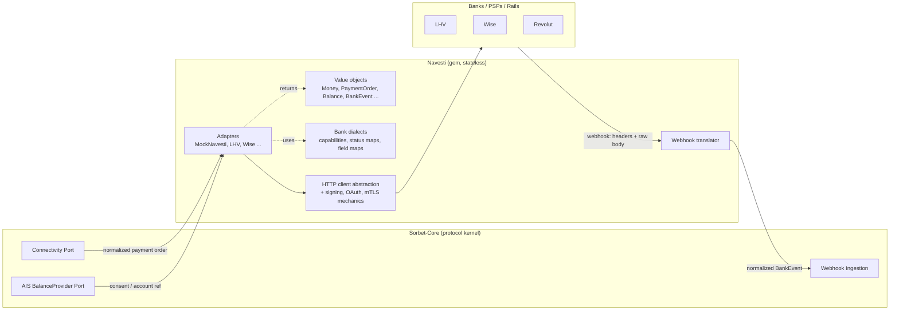

# 01 — Architecture

## Navesti as bank-driver layer

Navesti is a **headless Ruby gem**. Think of it the way an OS thinks of device drivers: Sorbet-Core is the kernel that owns state and policy; Navesti is the driver layer that knows how to talk to each device (bank), in that device's own protocol, and reports back normalized facts.

Direction of knowledge: **Sorbet-Core knows Navesti; Navesti does not know Sorbet-Core.** Sorbet-Core's ports are implemented by thin wrappers (living in the Sorbet-Core repo) that call Navesti and translate Navesti's value objects into whatever Sorbet-Core wants internally.

## Composition with Sorbet-Core

- Sorbet-Core constructs an adapter (`Navesti.adapter(:lhv, credentials: ..., http: ...)`) with credentials supplied by the host.
- Sorbet-Core calls it with normalized inputs (payment order, consent reference) and its own connector idempotency key.
- Navesti performs the bank conversation and returns frozen value objects carrying raw evidence.
- Sorbet-Core persists evidence, applies business meaning, decides retries, owns dedup.

One call in, one normalized fact out. Navesti never calls back into the host except through values it returns.

## What is deliberately absent

| Absent | Who owns it instead |
|---|---|
| UI (HTML/CSS/React, consent and login pages, dashboards) | Banks (SCA/auth screens), Sorbet-Cockpit (product UX) |
| Database / persistence | Host application |
| Packet state machine | Sorbet-Core |
| Retry / failover | Sorbet-Core |
| Compliance decisions | Sorbet-Core |
| Ledger | Sorbet-Core |
| Webhook dedup / application semantics | Sorbet-Core |
| Credential storage | Host application |

Because Navesti holds no state, every call is a pure function of *(inputs, credentials, bank response)* → *(normalized fact + raw evidence)*. That is what makes adapters conformance-testable.

## Evidence preservation

Every value object that originates from a provider response carries a `raw` field: the unmodified body, the relevant headers, and the capture timestamp. Normalization never destroys information — it adds a canonical reading *alongside* the original. If normalization and raw evidence ever disagree, the evidence wins in any audit. (Details: [02-domain-model.md](02-domain-model.md), open question on evidence size in [13-open-questions.md](13-open-questions.md).)

## Adapter conformance

An adapter is not "done" when it works; it is done when it passes the conformance suite ([11-conformance-suite.md](11-conformance-suite.md)). The suite is the executable definition of the adapter contract: status categories, ambiguity behavior, evidence preservation, idempotency-key propagation, redaction. MockNavesti exists primarily to keep the suite honest before any real bank exists.

## Runtime shape

Library/gem first. A standalone service is considered later **only if forced** by security (certificate isolation), scaling, or compliance — and that decision would be a new ADR, not a drift.
