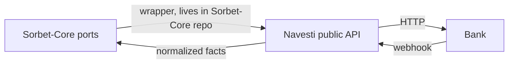

# 03 — Sorbet-Core Boundary

**This is the critical document.** It defines the three ports — from Sorbet-Core's point of view — that Navesti will back. Navesti implements the *concepts* these ports consume; the port interfaces themselves, and the wrappers that adapt Navesti to them, live in the Sorbet-Core repo. **Navesti does not import Sorbet-Core. Sorbet-Core does not reach into Navesti internals.**

> Explicit prohibition: **Navesti does not know what a Sorbet money packet is.** The words "packet", "ledger", "compliance", "route" do not appear in Navesti's public API.



## Port 1 — Connectivity dispatch

Sorbet-Core decided a payment should go out via a given connector. Navesti's job: have the bank conversation, report what happened, once.

```
Input:
- normalized payment order        (Navesti::PaymentOrder)
- connector idempotency key       (host-supplied, echoed back, sent to bank
                                   where the bank supports idempotency headers)
- route/rail metadata             (rail symbol + any rail options)

Output (Navesti::PaymentSubmission):
- status category: confirmed | rejected | ambiguous | pending
- provider_reference
- side_effect_possible
- interaction (when SCA required)
- raw evidence
```

Contract rules:

- One invocation = at most one bank submission attempt. **No retries inside Navesti** — a transport failure surfaces as `ambiguous` with evidence, and Sorbet-Core decides whether/when to retry with the same idempotency key.
- `side_effect_possible: false` is only ever returned with an explicit bank rejection or a failure provably before the request left (e.g. local validation, connection refused before write). When in doubt: `true`.
- The idempotency key is opaque to Navesti. Navesti maps it onto the bank's idempotency mechanism if one exists, and records in the dialect whether the bank honors it.

## Port 2 — AIS BalanceProvider

```
Input:
- consent/account reference       (provider consent id + access token, host-supplied)
- optional account id

Output (Navesti::Balance, one or many):
- balances
- available_amount_minor
- booked_amount_minor
- currency
- captured_at                     (UTC, when Navesti captured it — not bank book time)
- raw evidence
```

Contract rules:

- Navesti never refreshes/stores tokens on its own — expired token surfaces as a typed error (`Navesti::ConsentError` / `TokenExpired`), and the host re-supplies credentials (see [10-security-model.md](10-security-model.md) and open question 5).
- A missing balance field is not an error if the bank legitimately omits it; the conformance suite pins this behavior.

## Port 3 — Webhook translator

Sorbet-Core's HTTP endpoint receives the bytes; Navesti translates them.

```
Input:
- connector                       (which dialect to interpret with)
- headers                         (verbatim)
- raw body                        (verbatim bytes)

Output (Navesti::BankEvent):
- event_id
- provider_reference
- event type
- occurred_at
- status                          (when the event implies one)
- payload_fingerprint
- raw evidence
```

Contract rules:

- Signature verification happens here (dialect declares the scheme); a verification failure is a **distinct typed outcome**, not a parse error.
- Navesti is pure translation: same bytes in → same BankEvent out, every time. **Duplicate detection, ordering, application semantics (applied/duplicate/unmatched/rejected/provider_conflict) are Sorbet-Core's**, keyed on `event_id` + `payload_fingerprint`.

## Division of responsibilities

| Concern | Navesti | Sorbet-Core |
|---|---|---|
| Talk bank protocol (auth, signing, endpoints) | ✅ | ❌ |
| Normalize statuses/balances/events | ✅ | ❌ |
| Preserve raw evidence | ✅ produces | ✅ persists |
| Idempotency key | echoes + forwards | generates + enforces |
| Retry / failover | ❌ | ✅ |
| Webhook dedup & application | ❌ | ✅ |
| Token/credential storage | ❌ | host |
| Business meaning of facts | ❌ | ✅ |

## Versioning the boundary

The boundary contract is versioned by the Navesti gem version (SemVer; pre-1.0 minor bumps may break). Sorbet-Core wrappers pin a version range. Any change to output shapes requires a conformance-suite change in the same commit — the suite *is* the contract spec.
