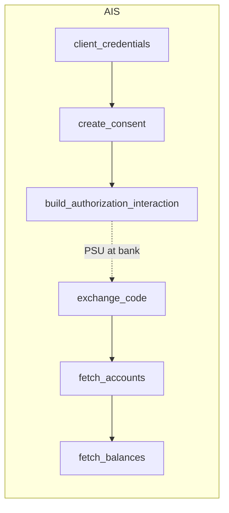

# 06 — Flow Language

The possible "flow as diagram" layer. **Idea, not framework. Do not implement a generic flow engine until the mock adapter proves what the interface needs.**

## Goal

> Bank flows should read like the bank documentation.

Every PSD2-ish bank documents its flows as a numbered sequence: get a token, create a consent/intent, send the PSU to SCA, exchange/submit, poll. Our adapters should be readable against that page.

## Canonical flows

```
AIS consent:
client_credentials -> create_consent -> build_authorization_interaction -> exchange_code -> fetch_accounts -> fetch_balances

PIS payment:
client_credentials -> create_payment_intent -> build_authorization_interaction -> submit_payment -> poll_status / wait_webhook
```



Note the dashed edge: flows **pause at interactions**. The host holds the descriptor, the PSU acts, the host calls the next step. This is why Navesti can stay stateless — the "flow state" is just the references the host carries between calls.

## Sketch (future, maybe)

```ruby
flow :ais_consent do
  step :client_credentials
  step :create_consent
  step :build_redirect
  step :exchange_code
end
```

## Warning — why we don't build this yet

The prior `pre_gem`-era DSL in this repo had a full workflow engine (`step`/`check`/`branch`/`on_error`) before the bank surface had stabilized, and the engine ended up owning retries and error policy that belong to Sorbet-Core. The failure mode of flow engines is always the same: the engine grows control-flow features (branching, retries, context passing) until it is a worse Ruby.

So, in order:

1. **Phase 1–5:** flows are plain, explicit adapter methods (`create_consent`, `exchange_code`, `submit_payment`, …). The "flow" is the documented calling order — captured as a comment block and as conformance tests, not as an engine.
2. **Phase 6:** if (three-times rule) the step sequences across MockNavesti + two real banks turn out to be structurally identical, extract `flow` as a *naming* layer — a declared list that documents order and lets the conformance suite verify each named step exists. Still no engine: no runtime that executes steps, no context object threaded through.
3. **Never (without a new ADR):** generic execution engine with branching, retry, or error policy.

## What a step *is* (whenever flows are named)

A step is an adapter method with the standard signature discipline: explicit inputs (references, tokens, orders), one bank conversation, returns a frozen value object or a typed error. If steps stay shaped like that, naming a flow later is trivial; if they don't, no flow engine will save us.
